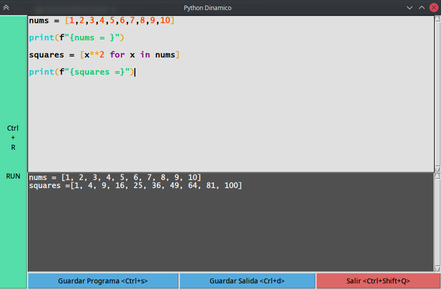
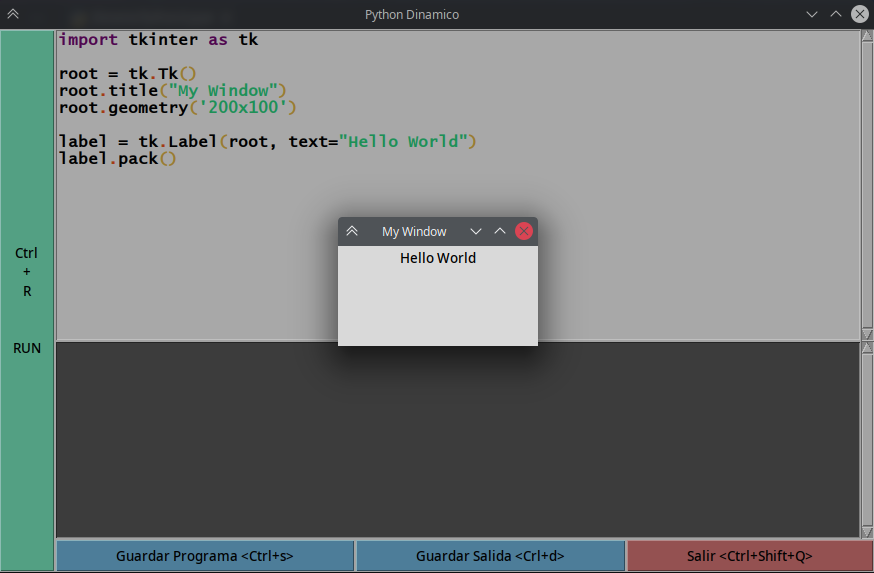
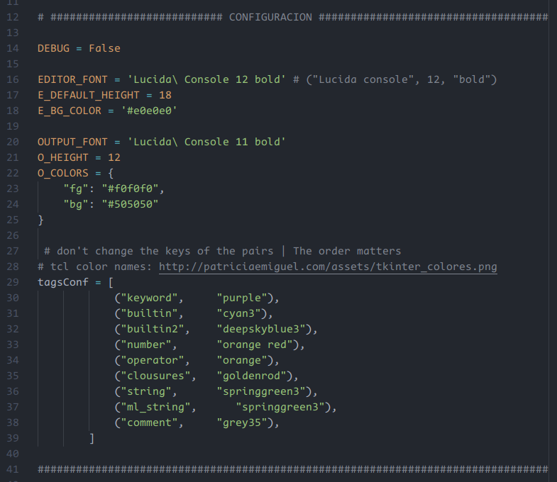

# Dinamic Python

***

This is a simple python executor like IDLE, but basic.
My intention was to have an editable REPL, for larger code blocks. Also I added the buttons to save the code and the resulting output, just that.
But then I added text highlighting, and it started to look like a python IDE.

Of course, this simple "little single file program" does not represent an alternative to common Python ides like Jupyter, Ipython, Spyder, PyCharm ... or even any intellisense server for code editors. 🎉 But you will fun!

---

---

Because I wanted to keep this simple. This is a single file program. After Imports, you would see some parameters for the customization:

Also you can practice adding some features like:

*(TODO:)*

+ Add auto-indentation.
+ Remove footer buttons and make a Menu instead.
+ Add "Open File" option.
+ Move and resize "Run" button to the Top.
+ Add color highlighting for locals and globals
+ Add a "Clear Output" button (a bit useless)

**Advanced:**

+ Find a better re pattern for multiline strings. (tcl's regexp 🤦).
+ Add Suggestions and auto-complete.
