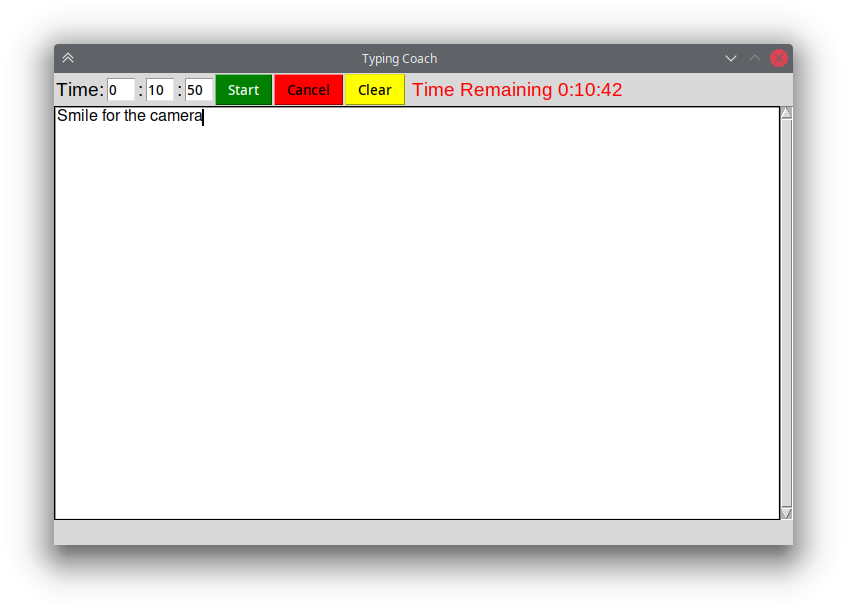
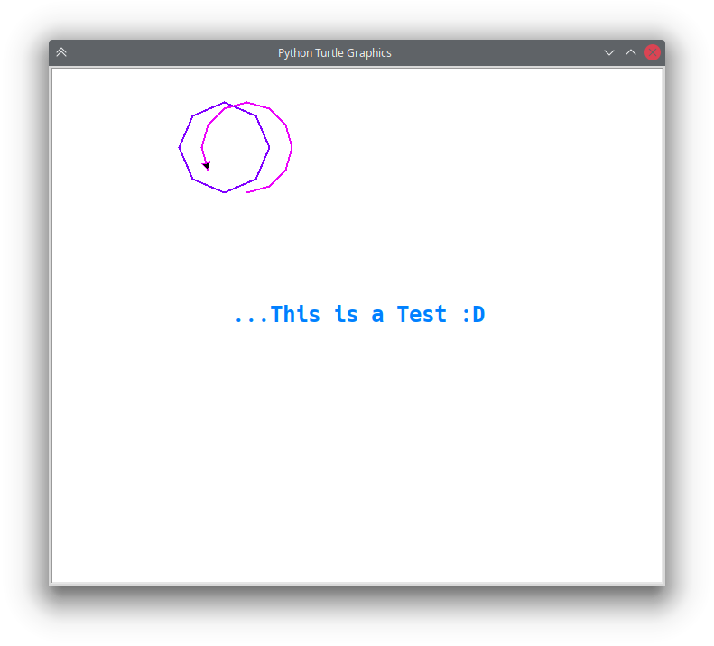

# Some GUIs

***

## FreqTransp

This is a simple tool to display the musical notes with their corresponding frequencies.


You can change the **octave** with the MIDDLE_OCT *const* in the script, that is 4 by default:
```python
...
MIDDLE_OCT = 4
...
```
*TODO:*
+ A field that recognizes if a number or a text (note name) is entered and searches for the closest match.

***

## TypingCoach

This program is for typing training.



*TODO:*
+ Connect with an API for orthographic correction to count errors.
+ (Alternatively, a text could be presented to copy and contrast them.)
+ Consequently add a menu to handle one of the above options.


***

## egTurtle

Okay ... nothing to say about it. 
        
>...Except, "don't spend time on this 😅


