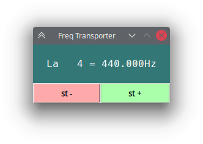

# Some GUIs

***

## TranFrec

This is a simple tool to display the musical notes with their corresponding frequencies.



You can change the **octave** with the MIDDLE_OCT *const* in the script, that is 4 by default:
```python
...
MIDDLE_OCT = 4
...
```
